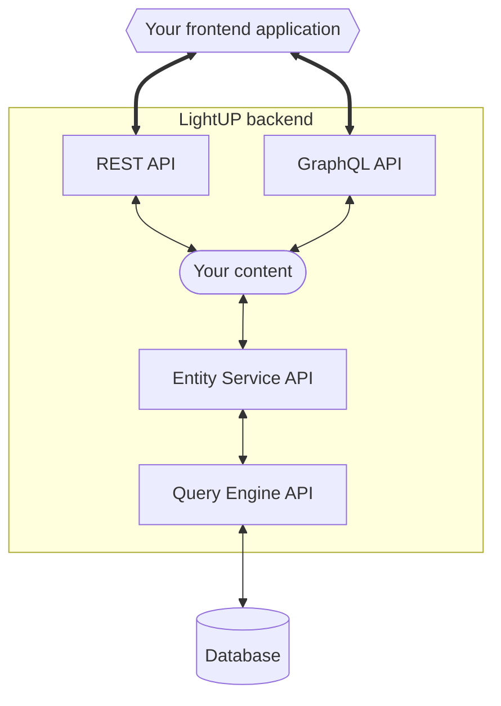

# LightUP APIs to access your content

Once you've created and configured a LightUP project, created a data structure and started adding data , you likely would like to access your content.

From a front-end application, your content can be accessed through LightUP's Content API, which is exposed:

- by default through the [REST API](/dev-docs/api/rest)
- and also through the [GraphQL API](/dev-docs/api/graphql) .

REST and GraphQL APIs represent the top-level layers of the Content API exposed to external applications.

 

This documentation section includes reference information about the following LightUP APIs and some integration guides with 3rd party technologies:

<CustomDocCardsWrapper>

<CustomDocCard emoji="↕️" title="REST API" description="Query the Content API from a front-end application through REST." link="/dev-docs/api/rest" />

<CustomDocCard emoji="↕️" title="GraphQL API" description="Query the Content API  from a front-end application through GraphQL." link="/dev-docs/api/graphql" />

</CustomDocCardsWrapper>
